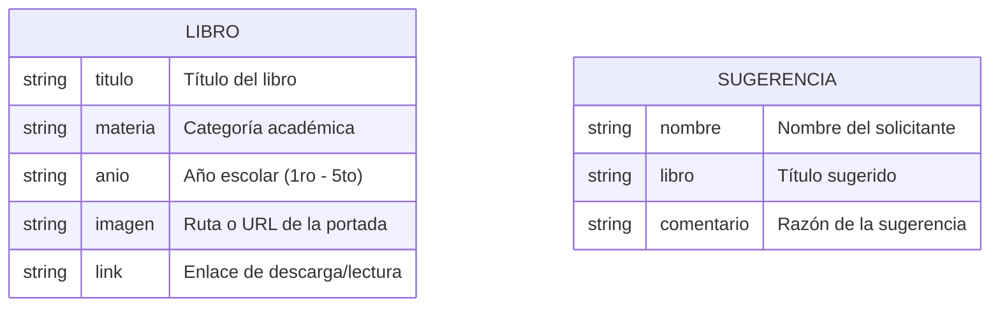
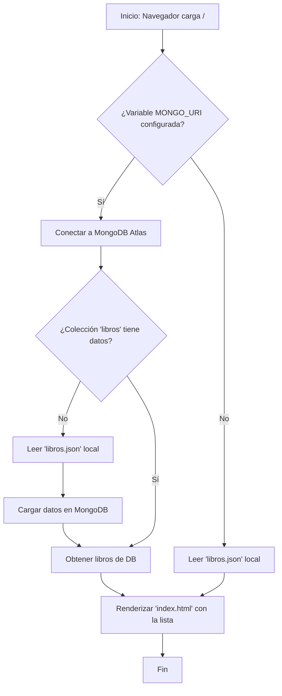
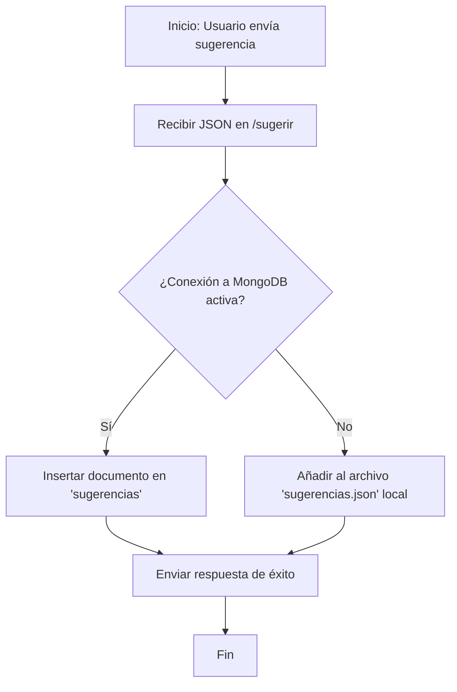

# DIAGRAMAS DEL SISTEMA - BIBLIOTECA VIRTUAL

## 1. Diagrama de Entidad-Relación (Base de Datos NoSQL)

Aunque utilizamos MongoDB (orientado a documentos), este es el modelo lógico de los datos:

## 2. Flujo de Consulta de Libros (Ruta Principal)

Este flujo describe cómo el sistema decide de dónde obtener la información al cargar la página.

## 3. Flujo de Sugerencias (Persistencia)

Describe el proceso desde que el usuario envía el formulario hasta que se guarda permanentemente.

